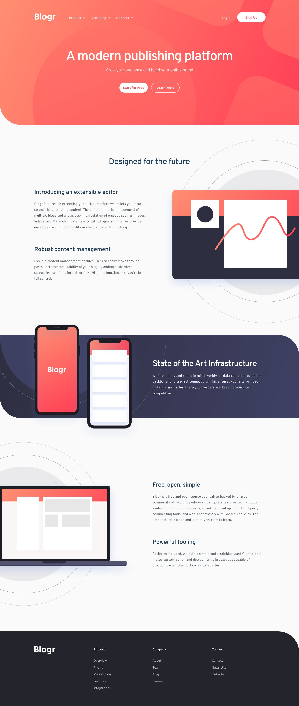
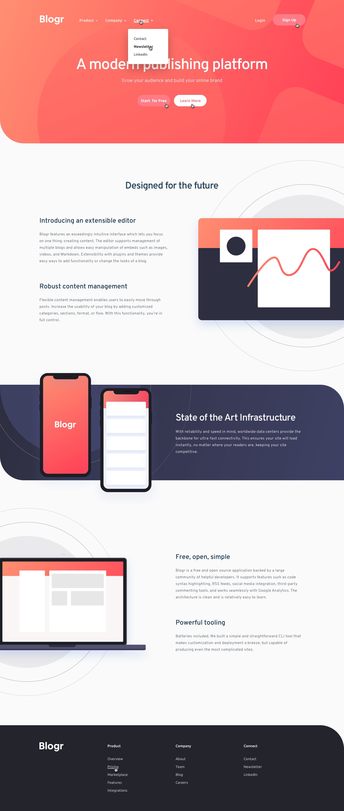
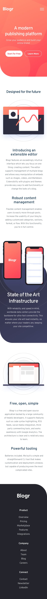
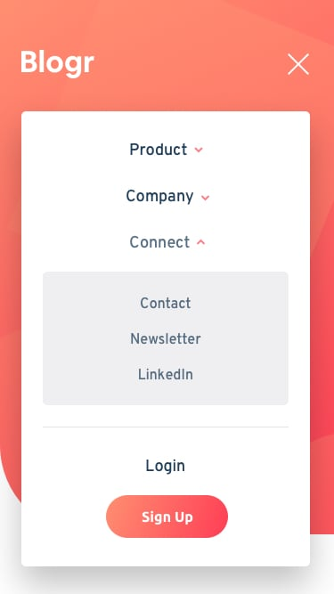

# Frontend Mentor - Solución Blogr Landing Page

Esta es mi solución al desafío **Blogr Landing Page** de Frontend Mentor. Este proyecto se enfoca en construir una landing page completamente responsiva con menús de navegación desplegables interactivos tanto para móvil como para escritorio usando HTML, CSS y JavaScript puro.

Este desafío fue una gran oportunidad para practicar estructura semántica en HTML, arquitectura moderna en CSS, técnicas de diseño responsivo y manipulación del DOM sin depender de frameworks o librerías externas.

---

## Tabla de contenidos
- [Resumen](#resumen)
- [El desafío](#el-desafío)
- [Diseño](#diseño)
- [Enlaces](#enlaces)
- [Mi proceso](#mi-proceso)
- [Tecnologías utilizadas](#tecnologías-utilizadas)
- [Lo que aprendí](#lo-que-aprendí)

---

## Resumen
Este proyecto es una landing page responsiva para una plataforma moderna de publicación llamada **Blogr**, que incluye un sistema de navegación interactivo con menús desplegables tanto en móvil como en escritorio.

La interfaz incluye un menú de navegación móvil, submenús desplegables, cambio dinámico de iconos y ajustes de layout responsivo en diferentes tamaños de pantalla siguiendo un enfoque mobile-first.

Todo el diseño está implementado con técnicas modernas de CSS, mientras que la interactividad se logra mediante JavaScript puro utilizando manipulación del DOM y event listeners.

---

## El desafío
Los usuarios deben poder:

- Ver el layout óptimo según el tamaño de su pantalla.
- Experimentar un diseño responsive con enfoque mobile-first.
- Abrir y cerrar el menú de navegación móvil.
- Alternar submenús desplegables en navegación móvil y de escritorio.
- Ver cómo los iconos de flechas rotan según el estado del submenú.
- Cerrar los menús al hacer clic fuera de ellos.
- Ver estados hover y focus en elementos interactivos.
- Experimentar transiciones suaves entre estados de la interfaz.

---

## Diseño

- Diseño de escritorio  

- Estados activos  

- Diseño móvil  

- Menú móvil  

---

## Enlaces
- URL del repositorio: [GitHub Repository](https://github.com/mlopezl/blogr-landing-page)
- URL del sitio en vivo: [Live Demo](https://mlopezl.github.io/blogr-landing-page/)

---

## Mi proceso
- Estructuré el layout usando elementos semánticos de **HTML5** como `header`, `nav`, `main`, `section` y `footer`.
- Seguí un enfoque **mobile-first**, mejorando progresivamente el diseño con media queries.
- Construí los layouts principalmente usando **Flexbox** para alineación, espaciado y estructura responsiva.
- Utilicé **variables CSS (custom properties)** para crear un sistema de colores consistente y reutilizable.
- Apliqué la metodología **BEM** para mantener un CSS modular, escalable y legible.
- Implementé menús desplegables para navegación tanto en móvil como en escritorio.
- Creé un panel de navegación móvil que cambia su visibilidad con JavaScript.
- Utilicé **manipulación del DOM con JavaScript** para controlar dinámicamente los estados del menú.
- Gestioné estados de la interfaz agregando y eliminando clases CSS como `hidden` y `rotate`.
- Implementé rotación de iconos para reflejar el estado abierto/cerrado de los submenús.
- Añadí un listener global para detectar clics fuera del menú y cerrar elementos abiertos.
- Mantuve una separación clara entre estructura (HTML), estilos (CSS) y comportamiento (JavaScript).

---

## Tecnologías utilizadas
- HTML5
- CSS3
- JavaScript (ES6)
- Flexbox
- Variables CSS (custom properties)
- Enfoque mobile-first
- Principios de diseño responsivo
- Metodología BEM
- Manipulación del DOM
- Event listeners
- Media queries

---

## Lo que aprendí
- Estructurar layouts responsivos usando **HTML semántico**.
- Construir layouts flexibles y adaptativos con **Flexbox**.
- Organizar estilos escalables usando la metodología **BEM**.
- Crear sistemas reutilizables con **variables CSS**.
- Implementar sistemas de navegación desplegable con **JavaScript puro**.
- Gestionar el estado de la UI agregando y eliminando clases dinámicamente.
- Manejar lógica separada para navegación móvil y de escritorio.
- Detectar clics fuera de elementos para mejorar la experiencia de usuario.
- Implementar comportamiento responsivo con **media queries**.
- Escribir código frontend limpio, modular y mantenible sin frameworks.